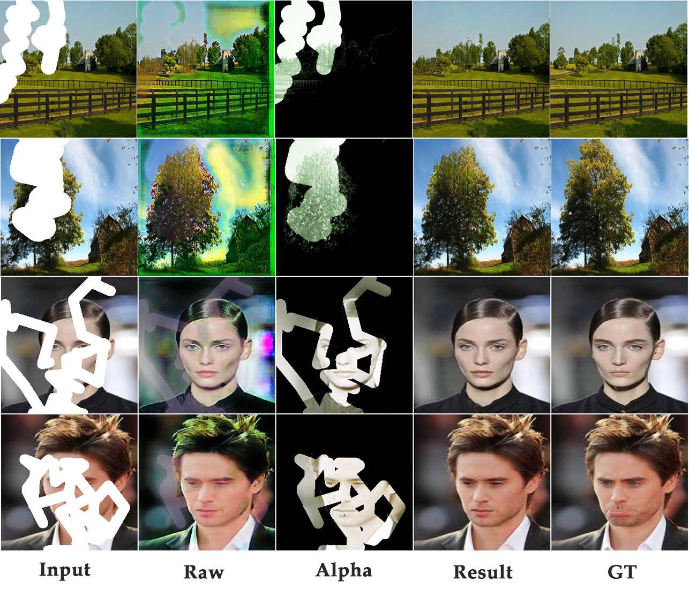
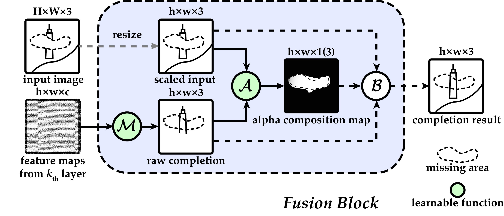

# Deep Fusion Network for Image completion

Official repository for ["Deep Fusion Network for Image completion"](https://github.com/hughplay/DFNet).

<!--  -->


**Figure:** *Results from DFNet. Fusion Result = (1 - Alpha) \* Input + Alpha \* Raw. Both Raw and Alpha are model outputs.*

> **Deep Fusion Network for Image Completion** <br>
> Xin Hong, Pengfei Xiong, Renhe Ji, Haoqiang Fan <br>
> *Published on Proceedings of the 27th ACM International Conference on Multimedia (ACMMM 2019)*

<!-- [](https://hongxin2019.github.io) -->
[](https://github.com/hughplay/DFNet)
[](https://dl.acm.org/doi/pdf/10.1145/3343031.3351002)
[](https://colab.research.google.com/github/hughplay/DFNet/blob/master/demo.ipynb)
[](https://pytorch.org/get-started/locally/)
<!-- [](https://pytorchlightning.ai/) -->
[](https://hydra.cc)


## Description

Deep image completion usually fails to harmonically blend the restored image into existing content,
especially in the boundary area. And it often fails to complete complex structures.



We first introduce **Fusion Block** for generating a flexible alpha composition map to combine known and unknown regions.
It builds a bridge for structural and texture information, so that information in known region can be naturally propagated into completion area.
With this technology, the completion results will have smooth transition near the boundary of completion area. Furthermore, the architecture of fusion block enable us to apply **multi-scale constraints**.
Multi-scale constrains improves the performance of DFNet a lot on structure consistency.

Moreover, **it is easy to apply this fusion block and multi-scale constrains to other existing deep image completion models**.
A fusion block feed with feature maps and input image, will give you a completion result in the same resolution as given feature maps.

If you find this code useful, please consider to star this repo and cite us:

``` bibtex
@inproceedings{hongDeepFusionNetwork2019,
  title = {Deep {{Fusion Network}} for {{Image Completion}}},
  booktitle = {Proceedings of the 27th {{ACM International Conference}} on {{Multimedia}}},
  author = {Hong, Xin and Xiong, Pengfei and Ji, Renhe and Fan, Haoqiang},
  year = {2019},
  series = {{{MM}} '19},
  pages = {2033--2042},
  keywords = {alpha composition,deep fusion network,fusion block,image completion,inpainting}
}
```


## Prerequisites
- Python 3
- PyTorch 1.0
- OpenCV


## Testing

We provide an interactive [Colab demo](https://colab.research.google.com/github/hughplay/DFNet/blob/master/demo.ipynb) for trying DFNet. You can also test our model with the following steps.

Clone this repo:

``` py
git clone https://github.com/hughplay/DFNet.git
cd DFNet
```

Download pre-trained model from [Google Drive](https://drive.google.com/drive/folders/1lKJg__prvJTOdgmg9ZDF9II8B1C3YSkN?usp=sharing)
and put them into `model`.

### Testing with Places2 model

There are already some sample images in the `samples/places2` folder.

``` sh
python test.py --model model/model_places2.pth --img samples/places2/img --mask samples/places2/mask --output output/places2 --merge
```

### Testing with CelebA model

There are already some sample images in the `samples/celeba` folder.

``` sh
python test.py --model model/model_celeba.pth --img samples/celeba/img --mask samples/celeba/mask --output output/celeba --merge
```

## Training

Please refer to: https://github.com/deepcodebase/inpaint. It is building in progress but looks good so far.

## License

<a rel="license" href="http://creativecommons.org/licenses/by-nc/4.0/"></a><br />This work is licensed under a <a rel="license" href="http://creativecommons.org/licenses/by-nc/4.0/">Creative Commons Attribution-NonCommercial 4.0 International License</a>.

